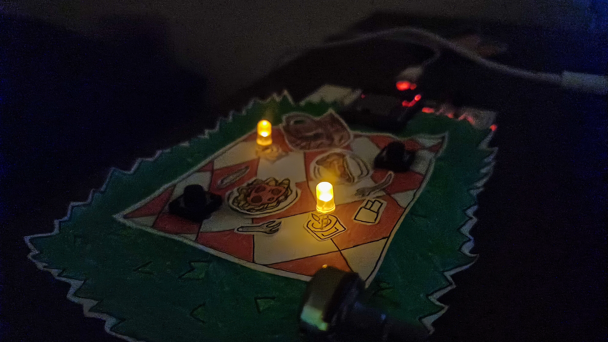
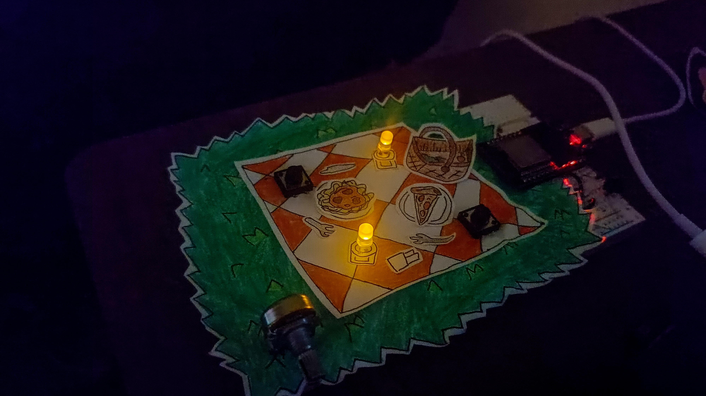
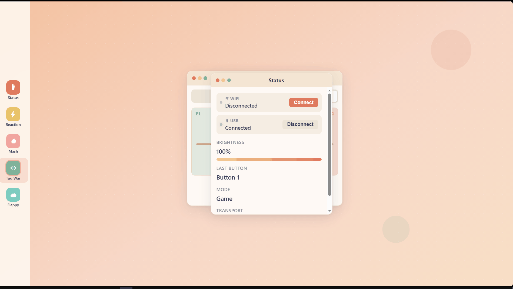

# 📟 Arduino Picnic Project by Kim

A fully offline, interactive ESP32 project designed like a picnic date. It features LED candles, a web interface, and 5 mini-games you can play with buttons.

<!--  -->

---

## How It Came To Be

It started off with the silly idea of drawing the picnic on grass part. After I was done, I thought of how it would look really good if I replaced the candles with my LEDs. How it would look `aesthetic`. Like a snowball effect, it all spiraled into it having more features. Buttons, my old ESP32, and so on.

It's a good way of surprising your loved ones by showing your nerdy skills off by making it interactive for them. They'll definitely appreciate it. 10/10, I'd recommend for haha(s) and giggles.

---

## Features

- **🕯️ LED Candles:** added a flickering effect.
- **🎛️ Analog Brightness:** Turn the potentiometer to dim or brighten the candles.
- **🖥️ Desktop UI:** A web interface styled like a cartoon operating system (draggable windows, macOS dots, warm pastel).
- **📡 Dual Connection:** Connect over the ESP32's WiFi hotspot OR plug it in via USB. 
- **🎮 5 Built-in Games:** Reaction Time, Button Mash, Tug of War, and a Flappy Bird clone.
- **👥 1v1 Mode:** Mash, Tug of War, and Reaction all have 1v1 modes. Player 1 uses Button 1, Player 2 uses Button 2.

---

## Materials Needed (+ Pinout)

| Component | Qty | ESP32 Pin | Code Variable |
| :--- | :---: | :---: | :--- |
| ESP32 Board | 1 | - | - |
| LED | 2 | GPIO 25 | `LED1` |
| | | GPIO 26 | `LED2` |
| Push Button | 2 | GPIO 18 | `BUTTON1` |
| | | GPIO 19 | `BUTTON2` |
| Potentiometer (10k) | 1 | GPIO 34 | `POT` |
| Breadboard & Wires | - | - | - |

*(Buttons use internal pull-ups, so just wire them straight to GND. Don't forget resistors for your LEDs)*

---

## Software & Dependencies

- **Arduino IDE** (v1.8+ or v2.x)
- **ESP32 Board Core** (v2.x or v3.x)
- **Library:** [WebSockets by Markus Sattler](https://github.com/Links2004/arduinoWebSockets) (install via Library Manager)

---

## How to Install?

1. Clone or download this repo.
2. Open `main.ino` in the Arduino IDE. Make sure you have the right board and port selected.
3. **Upload the filesystem:** The ESP32 serves the website from its memory, so you need to upload the `data/` folder (which contains the HTML, CSS, JS, and font files) using LittleFS. 
4. **Upload the code:** Hit upload on the Arduino IDE. 

---

## How to Connect?

**Option A: WiFi (Truly Wireless)**
1. Power the ESP32 with a power bank or USB charger.
2. On your phone/laptop, connect to the WiFi network:
   - **Name:** `ArduinoPicnic`
   - **Password:** `picnic123`
3. Open your browser and go to `http://192.168.4.1`.

**Option B: USB (Wired)**
1. Plug the ESP32 into your computer.
2. Open the `index.html` file locally in **Chrome** or **Edge**.
3. Click "Connect" under the USB section in the Status window to allow serial access.

---

## How to Play?

1. Click an icon on the left sidebar to open a game window.
2. Toggle between **1 Player** and **1v1** at the top of the game window.
3. Hit **Start**.
4. Mash the physical buttons! (If you don't have the hardware handy, you can use your keyboard: `Space` = Button 1, `Enter` = Button 2).
5. Win tallies are tracked in 1v1 mode. Close a window to cleanly exit a game and turn the candles back on.

---

## Protocols

The website and the ESP32 talk to each other using simple text messages. Because the format is exactly the same whether you're on WiFi or USB, the games and UI don't actually care how you're connected.

**ESP32 → Browser:**
- `POT:2048\n` (Sent twice a second with the current knob value)
- `BUTTON_1\n` / `BUTTON_2\n` (Sent the exact millisecond a button is pressed)

**Browser → ESP32:**
- `MODE:GAME\n` / `MODE:CANDLE\n` (Tells the ESP32 to stop/start the flicker effect)
- `LED1:ON\n` / `LED1:OFF\n` / `LED1:VAL:128\n` (Direct hardware control for game feedback)

---

## Notes

- Make sure to install the necessary ESP32 library like the espressif systems and LittleFS ones.
- LittleFS has a tutorial on this website: [https://randomnerdtutorials.com/arduino-ide-2-install-esp32-littlefs/]
- If you noticed, there's no Arduino components here. My bad, `Arduino Picnic Project` just sounds better than `ESP32 Picnic Project`.